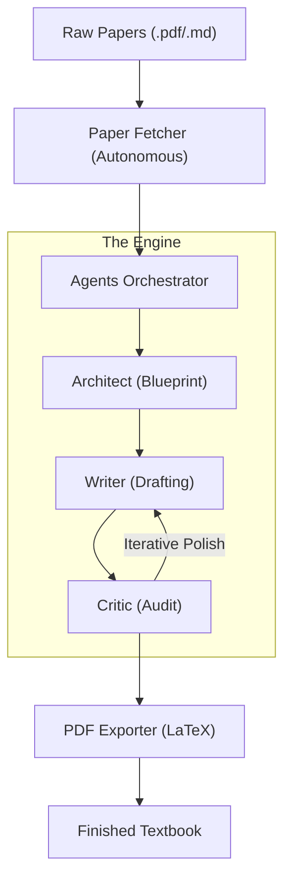

# 📖 antigravity-factory v1.0

> **The industrial-grade AI pipeline for high-fidelity technical publishing.**
>
> 🔗 [GitHub Repository](https://github.com/minthanthtoo/antigravity-factory)

# 🌌 The Motivation: Research Synthesis at Scale

The Antigravity Engine streamlines the transition from **Literature Review** to **Published Knowledge**. It autonomously groups hundreds of scattered research papers and synthesizes them into a single, high-fidelity LaTeX textbook.

<p align="center">
  
  
</p>

<p align="center">
  <b>Source: Raw Academic Corpus</b> &nbsp; ➔ &nbsp; <b>Output: Synthesized LaTeX Book</b>
</p>

### 🗺️ Data Flow Diagram


---

## 🏗️ 1. Architecture Overview

The factory employs four specialized, autonomous components:

| Component | Responsibility | Relevant File |
| :--- | :--- | :--- |
| **The Engine** | Orchestrates agent swarms and manages the pipeline. | `agents_orchestrator.py` |
| **The Curator** | Executes autonomous arXiv research and retrieval. | `paper_fetcher.py` |
| **The Constitution** | Enforces cognitive protocols and Anti-Slop laws. | `protocols.md` |
| **The Mastering** | Automates production via LaTeX/PDF generation. | `pdf_exporter.sh` |

### 🧠 Cognitive Agents (`prompts/`)
The `prompts/` directory houses the specialized "minds" of the system:
- `architect.md`: Designs the structural blueprint and synthesis matrix.
- `writer.md`: Generates technical prose following "The Hemingway Rule."
- `critic.md`: Audits drafts for precision, gaps, and citation integrity.
- `summarizer.md`: Preserves long-term coherence across chapters.

---

## 🛠️ 2. Rapid Setup

### A. Environment
Ensure you have Python 3.10+ and the required dependencies:
```bash
pip install -r requirements.txt
```

### B. API Configuration
The factory uses the Google Gemini API. Set your key as an environment variable:
```bash
export GOOGLE_API_KEY="your_api_key_here"
```

### C. Directory Structure
```bash
mkdir papers   # Input: Drop PDFs or MD research files here.
mkdir book_out # Output: Final validated chapters appear here.
```

---

## 🚀 3. Production Workflow

### Step 1: Configure Your Project
Open `agents_orchestrator.py` and update the `cfg` block:
```python
cfg = {
    "SEARCH_QUERY": "physics of agentic ai",
    "PAPER_LIMIT": 5,
    "MODEL_NAME": "gemini-2.0-flash-exp", # Options: gemini-2.0-flash-exp, gemini-3.0-pro, gemma-2-27b-it
}
```

### Step 2: Trigger the Pipeline
Run the orchestrator to fetch research and draft the book:
```bash
python3 agents_orchestrator.py
```

### Step 3: Export to PDF
Compile the drafts using the production-grade LaTeX builder:
```bash
./pdf_exporter.sh
```

---

## 🌌 4. Advanced Features

> [!IMPORTANT]
> **Level 9 Hardening**: This engine is protected against "Strategic Drift." Every turn is audited by a Critic Swarm focusing on citation integrity and active-voice precision.

> [!TIP]
> **Singularity Prompt**: Found in `grand_curation_prompt_v2.md`. Use this for "zero-dependency" manual generation in any frontier LLM (Gemini 1.5 Pro, Claude 3.5).

---

**© 2025 Antigravity AI Systems** | *Drafting the Future of Agentic Intelligence.*
