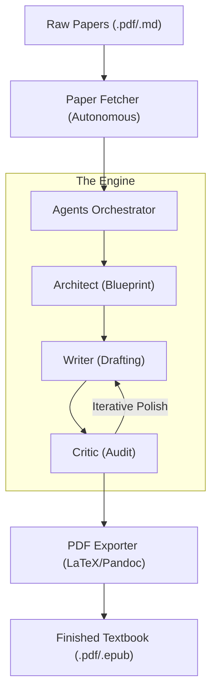

# 📖 antigravity-factory v1.0

> **The industrial-grade AI pipeline for high-fidelity technical publishing.**
>
> 🔗 [GitHub Repository](https://github.com/minthanthtoo/antigravity-factory)

# 🌌 The Motivation: Research Synthesis at Scale

**Problem**: Scientific knowledge is fragmented across millions of PDFs.  
**Solution**: The **Antigravity Factory**—an autonomous intelligence rig that turns scattered research papers into high-fidelity, industrial-grade textbooks.


---

## 🚀 Level 1: Quick Start (30 Seconds)

Get your first autonomous book running in three commands.

### 1. Install
Require Python 3.10+.
```bash
pip install -r requirements.txt
```

### 2. Set API Key
Export your credentials (or define them in config later).
```bash
export GOOGLE_API_KEY="AIzaSy..."
```

### 3. Ignite
Tell the factory what to research.
```bash
python3 agents_orchestrator.py -k "Quantum Machine Learning" -l 3
```
*The engine will fetch 3 papers, analyze them, and synthesize a textbook draft.*

---

## 🏭 Level 2: The Industrial Studio

Manage your projects like a pro with persistent configuration.

### The `factory_config.json`
Instead of using CLI flags every time, create a `factory_config.json` file in the root directory. The factory auto-loads these settings.

```json
{
  "SOURCES": "arxiv,semanticscholar,crossref",
  "PAPER_LIMIT": 10,
  "MODEL_NAME": "models/gemma-3-27b-it",
  "OUTPUT_FORMAT": "pdf",
  "GOOGLE_API_KEY": "",
  "CORPUS_PATH": "./papers",
  "OUTPUT_PATH": "./book_out"
}
```

### ✅ Verified Models (2025)
The factory is optimized for the following engines:
*   `gemini-2.5-flash` (High Speed, Logic)
*   `gemini-2.5-flash-lite` (Cost Efficient)
*   `models/gemma-3-27b-it` (Open Weight Powerhouse)
*   `gemma-3-12b` (Balanced)
*   `gemini-3-flash` (Next-Gen)


### 🎛️ Configuration Reference
Complete list of parameters supported in `factory_config.json`:

| Key | CLI Override | Description | Default / Example |
| :--- | :--- | :--- | :--- |
| **`MODEL_NAME`** | *N/A* | Target LLM for synthesis. | `"gemini-2.0-flash-exp"` |
| **`GOOGLE_API_KEY`** | *Env Var* | Gemini API Key. | `"AIzaSy..."` |
| **`SOURCES`** | `-S` | Research platforms to query. | `"arxiv,semanticscholar"` |
| **`PAPER_LIMIT`** | `-l` | Max papers to download. | `5` |
| **`FETCH_MODE`** | `-f` | Download type (pdf/abstract). | `"fulltext"` |
| **`OUTPUT_FORMAT`** | `-F` | Final artifact format. | `"pdf"`, `"docx"`, `"latex"` |
| **`START_DATE`** | `-a` | Filter papers **after** date. | `"2023-01-01"` |
| **`END_DATE`** | `-b` | Filter papers **before** date. | `"2025-12-31"` |
| **`SEARCH_QUERY`** | `-k` | Default topic if missing. | `"Agentic AI"` |
| **`MOCK_MODE`** | `-m` | Simulate LLM calls. | `true` |
| **`AUTO_CONFIRM`** | `-y` | Skip interactive prompts. | `true` |

> [!TIP]
> **Priority Flow**: The engine resolves settings in this order: **Base Defaults** ➔ **factory_config.json** ➔ **CLI Flags**. Flags passed via the terminal always take absolute precedence.

---

## 🏎️ Level 3: Advanced Engineering

For power users who need granular control and automation.

### CLI Mastery
Override your config on the fly with precision flags.

| Flag | Description | Example |
| :--- | :--- | :--- |
| `-k` | Search Keywords | `-k "Attention Is All You Need"` |
| `-l` | Paper Limit | `-l 50` |
| `-S` | Source Priority | `-S "semanticscholar,arxiv"` |
| `-F` | Output Format | `-F docx` (pdf, html, epub, docx, latex, json, md) |
| `-f` | Fetch Mode | `-f abstract` (Metadata only) |
| `-m` | Mock Mode | `-m` (Test pipeline without AI cost) |

### 🧠 Smart Resume Engine
The factory is bandwidth-aware. If you interrupt a research run, simply re-run the command:
- **Auto-Detection**: Identifying existing industry-standard paper IDs.
- **Verification**: Ensuring file integrity (>0 bytes) before skipping.
- **Idempotency**: Safe to run repeatedly without redundant data consumption.

### Programmatic Orchestration
Drive the factory directly from your Python scripts.

```python
from agents_orchestrator import Orchestrator

cfg = {
    "SEARCH_QUERY": "Physics of Agentic AI",
    "PAPER_LIMIT": 100,
    "MODEL_NAME": "gemini-3.0-pro",
    "FETCH_MODE": "fulltext"
}

# Ignite the swarm
engine = Orchestrator(cfg)
engine.execute_pipeline()
```

---

## 🏗️ Architecture: Under the Hood

How the machine thinks.

### Data Flow Diagram


### Component Matrix
| Component | Responsibility | File |
| :--- | :--- | :--- |
| **The Engine** | Orchestrates agent swarms. | `agents_orchestrator.py` |
| **The Curator** | Executes multi-source acquisition. | `paper_fetcher.py` |
| **The Constitution** | Enforces cognitive protocols. | `protocols.md` |
| **The Mastering** | Automates production. | `pdf_exporter.sh` |

---

## 🛡️ Level 9: Protocol Hardening

> [!IMPORTANT]
> **Strategic Drift Protection**: This engine is guarded by a "Critic Swarm" that audits every line for:
> 1.  **Citation Integrity**: No hallucinated sources.
> 2.  **Anti-Slop**: Enforces active voice and bans filler words ("delve", "rich tapestry").
> 3.  **Deduplication**: Intelligent merging of multi-source research.

---

**© 2025 Antigravity AI Systems** | *Drafting the Future of Agentic Intelligence.*
